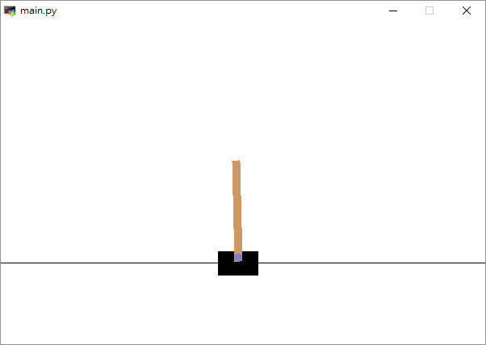

# Reinforce Learning Practice
CartPole - Double Deep Q Network

## Prerequisite
- Python 3.6.4

## Install Dependency
```sh
$ pip install -r requirements.txt
```

## Usage
```sh
$ python usage: main.py [-h] [-i ITERATION] [-m MEMORYSIZE]
```

| optional Options           | Description                                    |
| ---                        | ---                                            |
| -h, --help                 | show this help message and exit                |
| -i ITERATION               | input the iteration of training                |
| -m MEMORYSIZE              | input the size of memory                       |

## Game


## Algorithm
- Double Deep Q Network
  - Initialize Q network with parameters θ
  - Initialize enviroment and get current state s
  - According to s, Actor will give an action a: (ε-Greedy, e.g. ε = 0.9)
    - 10%: random choose one of actions 
    - 90%: choose the action with the highest 
  - Take the action, and observe the reward, r, as well as the new state, s'.
  - Update the θ for the state using the observed reward and the maximum reward possible for the next state.
    - 
    - 
  - Every C steps reset 
  - Set the state to the new state, and repeat the process until a terminal state is reached.

## Authors
[Yu-Tong Shen](https://github.com/yutongshen/)
