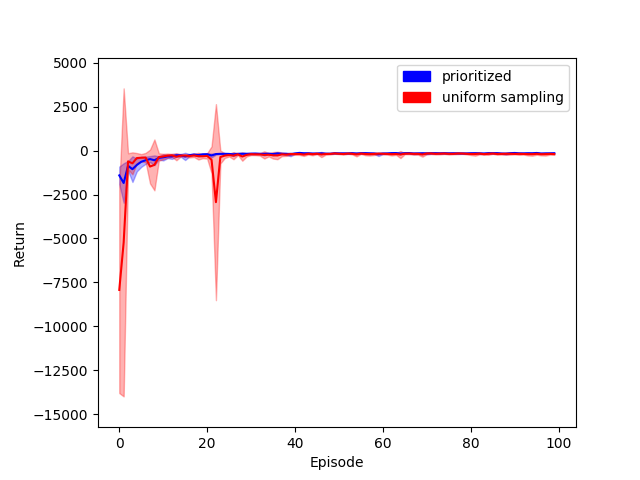
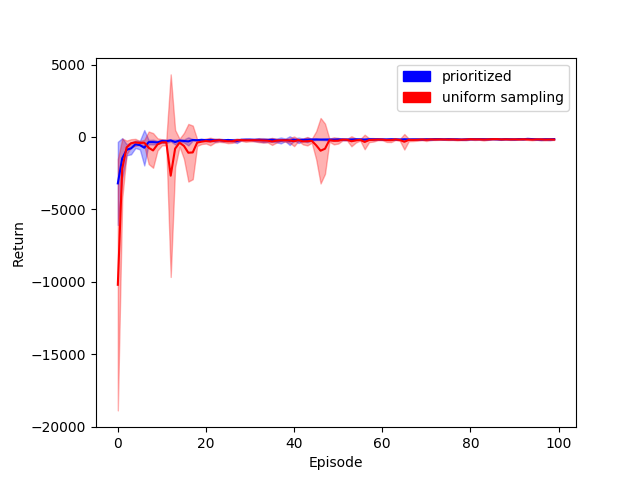
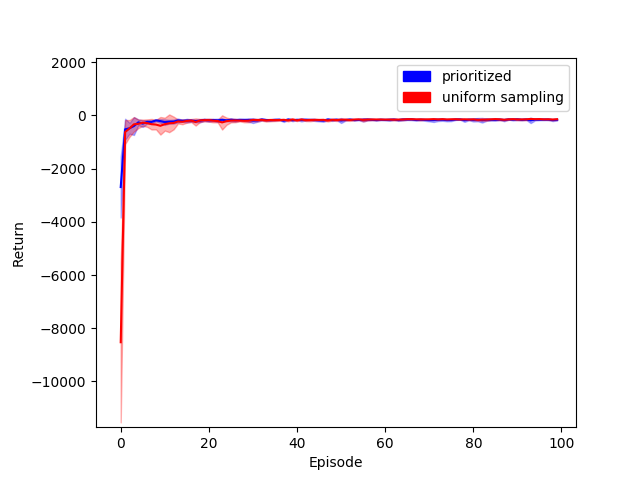
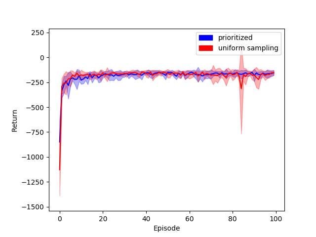

# Reinforce Learning Practice
Mountain Car (OpenAI gym) - Double Deep Q Network with Prioritized Experience Replay

## Prerequisite
- Python 3.6.4

## Install Dependency
```sh
$ pip install -r requirements.txt
```

## Usage
```sh
$ python usage: main.py [-h] [-i ITERATION] [-m MEMORYSIZE] [-b BATCHSIZE] [-lr LEARNINGRATE] [-hu HUMANEXP] [-hu--out HUMANEXPOUT] [-score--out SCOREOUT] [-screen SCREEN]
```

| optional Options           | Description                                    |
| ---                        | ---                                            |
| -h, --help                 | show this help message and exit                |
| -i ITERATION               | input the iteration of training                |
| -m MEMORYSIZE              | input the size of memory                       |
| -b BATCHSIZE               | input the size of batch                        |
| -lr LEARNINGRATE           | input learning rate                            |
| -hu HUMANEXP               | input human experience                         |
| -hu--out HUMANEXPOUT       | human experience output path                   |
| -score--out SCOREOUT       | score output path                              |
| -screen SCREEN             | show the screen of game (true/false)           | 


## Game


## Algorithm
- Double Deep Q Network With Prioritized Experience Replay
  - **Input:** minibatch k, step-size η, replay period K and size N, exponents α and β, budget
  - Initialize replay memory H = Φ,  = 0,  = 1
  - Observe  and choose 
  - **for** t = 1 **to** T **do**
    - Observe 
    - Store transition  in H with maximal priority 
    - **if** t ≡ 0 mod K **then**
      - **for** j = 1 **to** k **do**
        - Sample transition 
        - Compute importance-sampling weight 
        - Compute TD-error 
        - Update transition priority 
        - Accumulate weight-change 
      - **end for**
      - Update weights , reset ∆ = 0
      - From time to time copy weights into target network 
    - **end if**
    - Choose action 
  - **end for**

## Setting Reward
- According to [OpenAI gym](https://github.com/openai/gym/wiki/MountainCar-v0), we have:
  - **Observation**

  | Num | Observation | Min   | Max  |
  | --- | ---         | ---   | ---  |
  | 0   | position    | -1.2  | 0.6  |
  | 1   | velocity    | -0.07 | 0.07 |

- So we update agent with 
  - The range of reward will be -1 to +1
  - it makes car moving with higher velocity and closer edge

## Performance
> - note 1: The value of y-axis is original reward in episode, it is not used to update agent.
>   - **Original reward**: -1 for each time step, until the goal position of 0.5 is reached.
> - note 2: No matter which red or blue line are using double deep Q network.
> - note 3: Both its replay memory size are 10,000
>   - In this experiment, replay memory contain same 10,000 transitions that using randomly chooce action at the begining. 

### Changing the batch size
- **batch size: 16**, learning rate: 0.0005

- **batch size: 32**, learning rate: 0.0005

- **batch size: 64**, learning rate: 0.0005


> - As the batch size increases, double DQN without prioritized experience replay will be more stable (with lower standard deviation).
> - However, double DQN with prioritized experience replay remains stable throughout. 

### Changing the learning rate
- batch size: 32, **learning rate: 0.0005**

- batch size: 32, **learning rate: 0.001**

- batch size: 32, **learning rate: 0.01**


> - As the learning rate increases, both its average reward are higher.

### Summary
- Prioritized experience replay is better than uniform sampling
  - **More robust**:
    - In a prioritized experience replay agent, all new transitions arrive without a known TD-error, so we put them at maximal priority in order to guarantee that all experience is seen at least once.
  - **Has better score at the beginning**:
    - In the replay memory, there are almost redundant transitions. Using prioritized experience replay method makes rare and task-relevant transitions are sampled more easily, so this method will adapt to the environment earlier than uniform sampling.

## Conclusion
- **DQN belong to value-base**: 
  - The DQN agent always choose action via its action-value function (neural network). the action-value function (neural network) will tell which action is best, when it want to choose action. In addition, This agent use ε-greedy method, so that it will explore the environment (randomly choose action) with ε probability.
- **This algorithms is off-policy**:
  - An on-policy agent update self based on its current action derived from the current policy, whereas its off-policy counterpart update self based on the action obtained from another policy. In this algorithm, the agent sample transitions in the replay memory, but the replay memory contains a lot of different policies and those are almost not the current policy. So this algorithms is off-policy.
- **The replay memory method break the temporal correlations**:
  - In a deep Q network agent, it often randomly sample transition in replay memory. It means old and new transitions will be mixed, so that the temporal correlations will be broken. In addition, The replay memory method also makes rare experience will be used for more then just signle update.

## Authors
[Yu-Tong Shen](https://github.com/yutongshen/)
